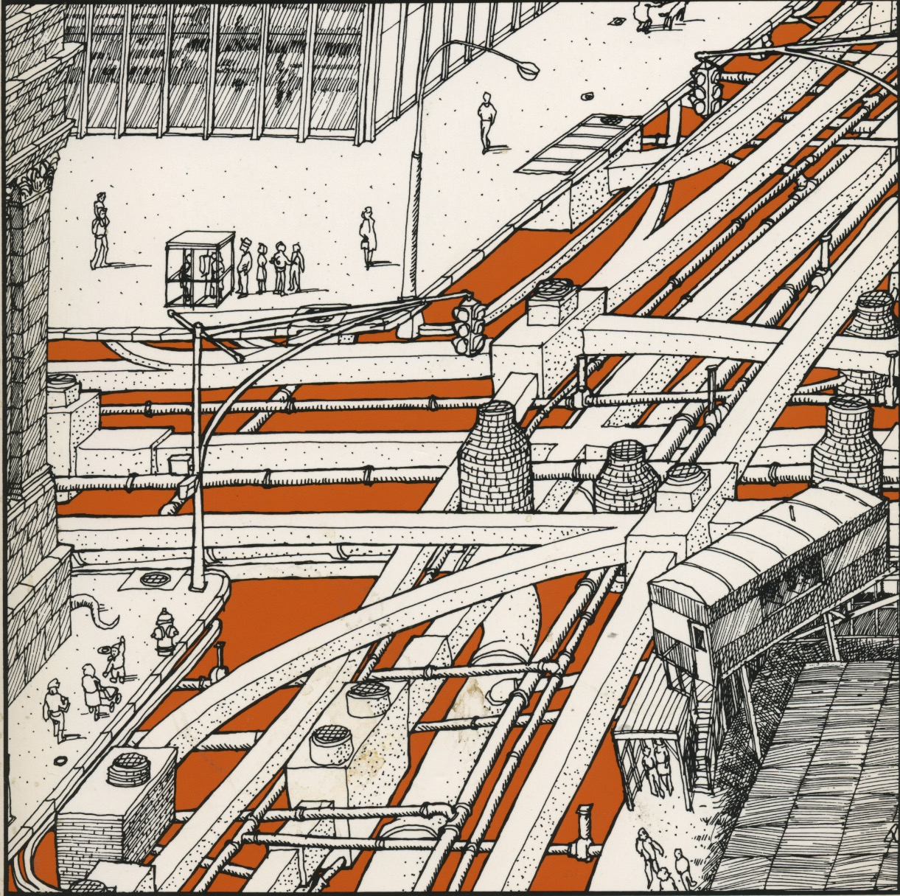

#### Sustainable and Resilient Infrastructure
# Creating a Better Future for our City
## Created by the
## Vision 2050 Task Force
## November 2019
#### Parallel Online WORKING DRAFT : 1 August 2019

[//]: # ()

 

*This report is about Berkeley's flows of people, water, power, goods, information, and money. These are the streets, pipes, power lines, communication networks and institutions that make Berkeley possible*

### Three Overlapping Entities Build Berkeley Infrastructure
- **City of Berkeley**:
  - streets, sidewalks, sewers, lights, parks
- **Residents, Businesses, and Institutions of Berkeley**
  - Homes, Businesses, Schools, Churches, University, Government
- **Outside Berkeley Resouce Network**
  - EBMUD, PG&E, Comcast, Sonic, ATT, Commmunity Power
  - Water pipes to Sierra Mountains; Electrical transmission lines to major grid generation sources; sewer pipes to EBMUD treatment center
#### In the Berkeley Free Speech tradition, this draft is published for comment, suggestion, and editing in a new format: JupyterBook format
